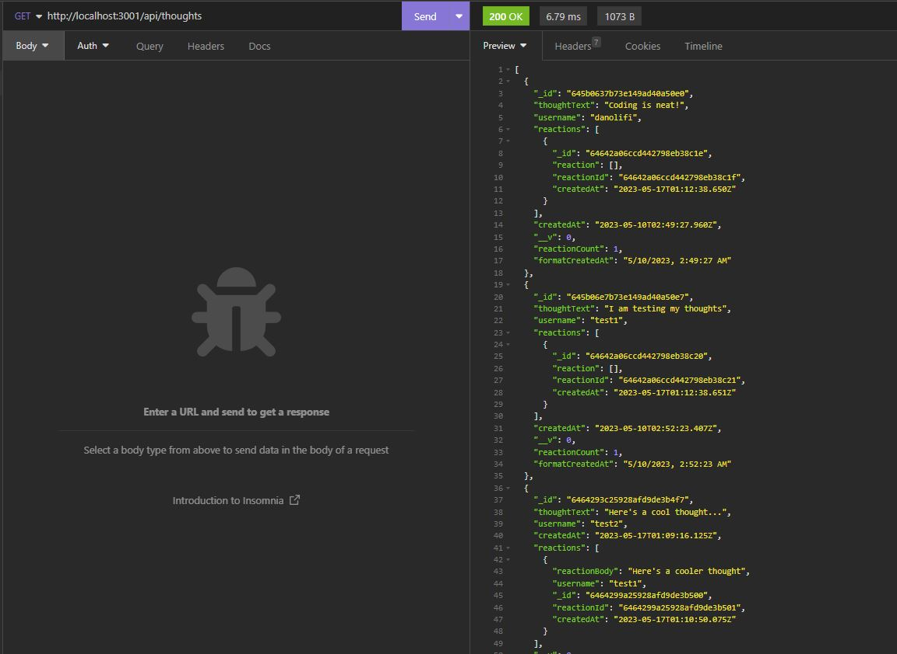

# Social App API

The objective is to build an API for a social network app using NoSQL database so that user can create, update, and delete users and thoughts using Insomnia.

## USER STORY

AS A social media startup 
I WANT an API for my social network that uses a NoSQL database 
SO THAT my website can handle large amounts of unstructured data 

### ACCEPTANCE CRITERIA
GIVEN a social network API 
WHEN I enter the command to invoke the application 
THEN my server is started and the Mongoose models are synced to the MongoDB database 
WHEN I open API GET routes in Insomnia for users and thoughts 
THEN the data for each of these routes is displayed in a formatted JSON 
WHEN I test API POST, PUT, and DELETE routes in Insomnia 
THEN I am able to successfully create, update, and delete users and thoughts in my database 
WHEN I test API POST and DELETE routes in Insomnia 
THEN I am able to successfully create and delete reactions to thoughts
and add and remove friends to a user’s friend list 

## The following is a screenshot of the final product:

## Click [here](https://github.com/dolivafig/SocialApp) to see the repo on gitHub.
## Click [here]() to view a demo of the app working.
